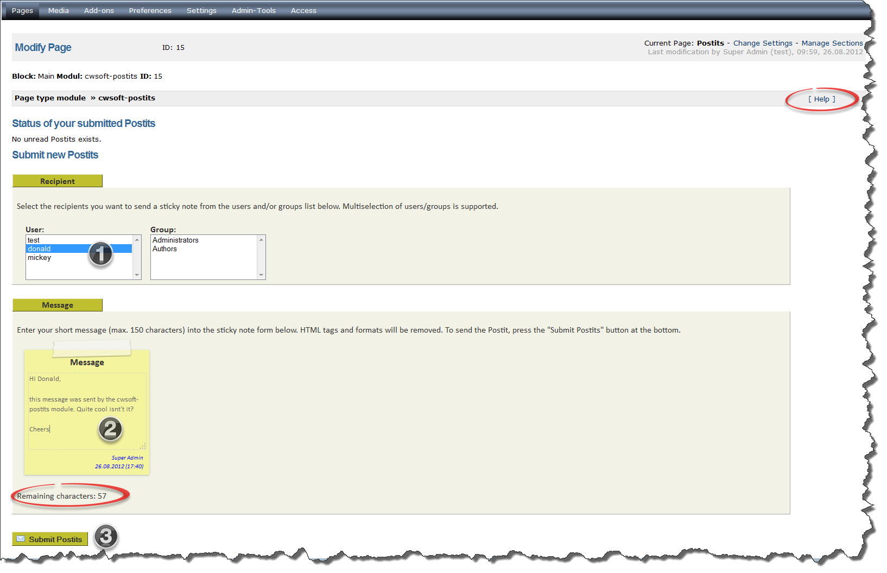
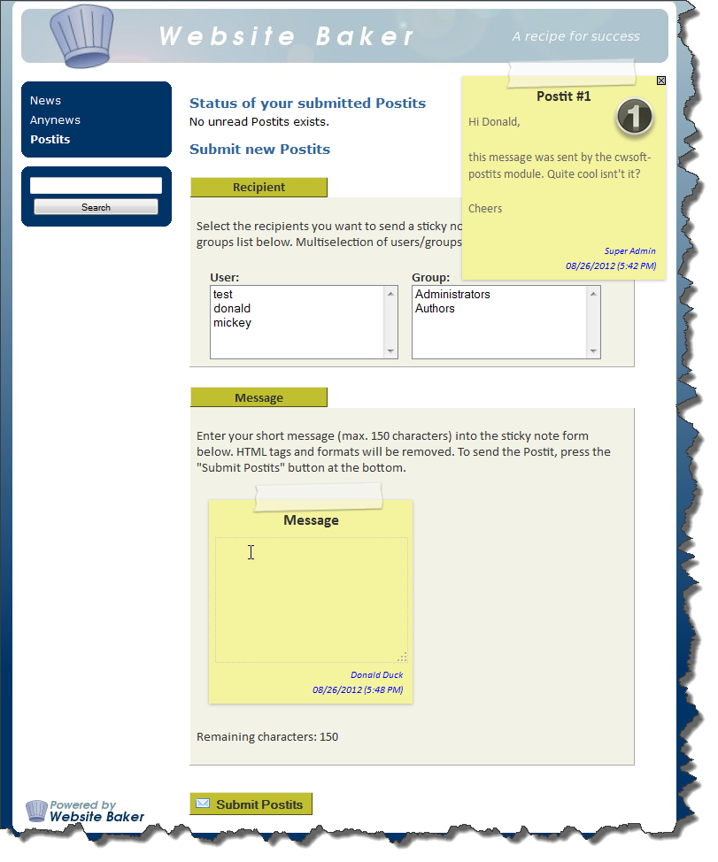

# cwsoft-postits module for CMS WebsiteBaker 2.8.x
The `cwsoft-postits` module allows logged in users to send short text messages (150 characters) to other users or groups via the [WebsiteBaker CMS](http://www.websitebaker2.org) frontend or backend. The Postits (sticky notes) are automatically faded into the frontend and/or backend view, once the recipient has logged into WebsiteBaker, no matter which page is displayed in the browser. The sender can check whether his note was already read by the recipient.

## Download
You can download an archive of the latest development branch of the `cwsoft-postits` module using GitHubs [ZIP button](https://github.com/cwsoft/wb-cwsoft-postits/archive/master.zip). The archives of previous module releases can be found in GitHubs [Tags section](https://github.com/cwsoft/wb-cwsoft-postits/tags). The development history is tracked via [GitHub](https://github.com/cwsoft/wb-cwsoft-postits/commits/master).

***Please note:*** The archives downloaded from GitHub are not ready for installation in WebsiteBaker, as GitHub includes the archive subfolder. To create a working WebsiteBaker installation archive, unpack the downloaded archive on your local computer and zip the contents of the folder ***cwsoft-postits*** (without the folder itself). Alternatively download an installable archive from the WebsiteBaker [module section](http://addons.websitebaker2.org/pages/en/browse-add-ons.php).

## License
The `cwsoft-postits` module is licensed under the [GNU General Public License (GPL) v3.0](http://www.gnu.org/licenses/gpl-3.0.html).

## Requirements

The minimum requirements to get `cwsoft-postits` running are as follows:

- WebsiteBaker ***2.8.2*** or higher (recommended last stable 2.8.x version)
- PHP ***5.2.2*** or higher (recommended last stable PHP 5.4.x version)
- small modification of your frontend template (optional backend template)
- your browser must have JavaScript enabled

## Installation
1. download latest [module archive](https://github.com/cwsoft/wb-cwsoft-postits/archive/master.zip) from GitHub
2. unpack the archive on your local computer
3. zip the contents of the folder ***cwsoft-postits*** (without the folder itself)
4. install the newly zipped archive via the WebsiteBaker installer
5. go to the pages section and create a new page of type `cwsoft-postits`
6. select your username from the users group and enter a short Postit message
7. press the "Submit Postit" button to send the Postit

### Frontend template modifications (OBLIGATORY)

Visit the Postit page you created in your frontend. If you see a JavaScript message, you need to adapt the ***index.php*** of your frontend template. Open your WebsiteBaker frontend template file ***index.php*** in the [cwsoft-addon-file-editor](https://github.com/cwsoft/wb-cwsoft-addon-file-editor#readme) and search for the following lines. 

	if (function_exists('register_frontend_modfiles')) {
		register_frontend_modfiles('css');
		register_frontend_modfiles('js');
	}

Change the lines above as follows:

	if (function_exists('register_frontend_modfiles')) {
		register_frontend_modfiles('css');
		register_frontend_modfiles('jquery');
        // ensure Postits show up on all frontend pages
        echo '';
		register_frontend_modfiles('js');
	}

Postits now automatically appear in your frontend, once the recipient is logged in. Reload the frontend view in your browser (F5) to see if it works. Per default, the Postits module checks every 30 seconds for new Postits. You can modify this value in the ***/javascript/postits.js*** file.

If it doesn't work, check if JavaScript is enabled in your browser. Ensure you added the code above in the given order to your default frontend template. The code must be placed within the `<head></head>` section.

### Backend template modifications (OPTIONAL)

If you want to show Postits also in the backend part of WebsiteBaker, you need to modify the template file ***header.htt*** of your backend theme. For the default backend theme of WebsiteBaker 2.8.3, the file is found at */templates/wb_theme/templates/header.htt*. Open the file with the [cwsoft-addon-file-editor](https://github.com/cwsoft/wb-cwsoft-addon-file-editor#readme) and search for the following lines at the top of the file.

	
	
	

Change the lines above as follows:

	
	
	
	
	<link href="{WB_URL}/modules/cwsoft-postits/css/postits.css" rel="stylesheet" type="text/css" />
	

Postits will now also appear in the backend part of your WebsiteBaker intallation.

## Usage

If you followed all steps above, it's time to play with the `cwsoft-postits` module. Log into WebsiteBaker backend and create a new page of type `cwsoft-postits`. Select the users or groups you want to send a Postit (1). Make use of multi-selection to send the same message to several users at the same time. Type in a message (max. 150 characters) into the Postit form field (2) and press the submit button (3).

A screenshot of the backend and frontend view of the cwsoft-postits module is shown below.

***Backend view:***

 

***Frontend view:***

 

***Note:*** Postits only appear in the frontend/backend of Website Baker, if the PostIt recipient is loged in. The Postits can be moved with the mouse and deleted by clicking the (x) icon in the top right Postits corner.

## Known Issues
You can track the status of known issues or report new issues found in `cwsoft-postits` via GitHubs [issue tracking service](https://github.com/cwsoft/wb-cwsoft-postits/issues). If you run into any issues with Postits, please visit this page first and check if this issue is already known.

## Questions
If you have questions or issues with the `cwsoft-postits` module, please visit the [English](http://www.websitebaker2.org/forum/index.php/topic,24901.0.html) or [German](http://www.websitebaker2.org/forum/index.php/topic,24897.0.html) WebsiteBaker forum support threads and ask for feedback.

***Always provide the following information with your support request:***

 - detailed error description (what happens, what have you already tried ...)
 - the `cwsoft-postits` version (go to WebsiteBaker section Add-ons / Info / cwsoft-postits)
 - your PHP version (use phpinfo(); or ask your provider if in doubt)
 - WebsiteBaker version, Service Pack number and build number of your version
 - name of the WebsiteBaker frontent template used (e.g. round, allcss ...)
 - information about your operating system (e.g. Windows, Mac, Linux) incl. version
 - information of your browser and browser version used
 - information about changes you made to WebsiteBaker (if any)

## Credits
Credits goes to the forum user [Marcus70](http://www.websitebaker2.org/forum/index.php?action=profile;u=12071) for maintaining cwsoft-postits from April to September 2009 and to the user [marmot](http://www.websitebaker2.org/forum/index.php?action=profile;u=19102) for providing some compatibility fixes for newer jQuery versions.